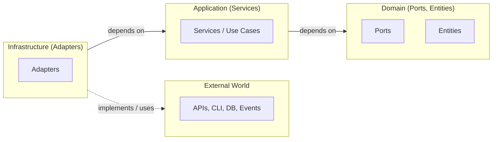
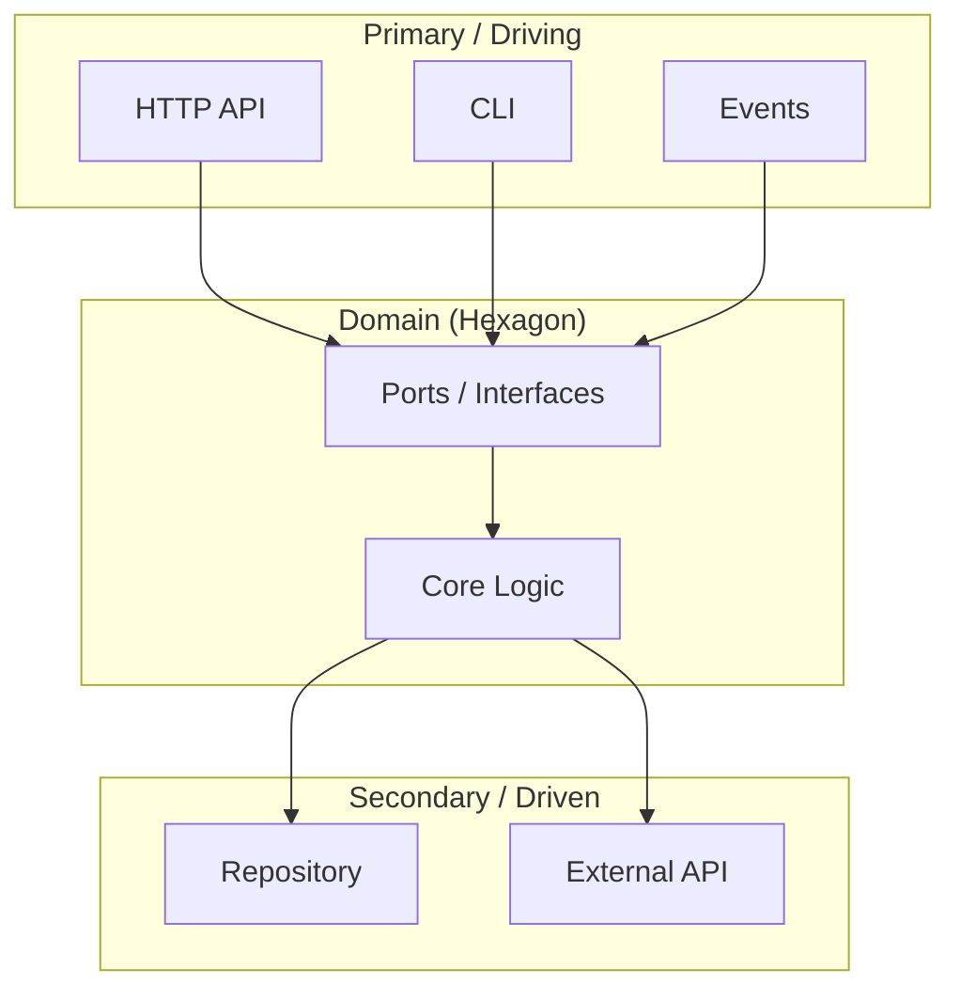
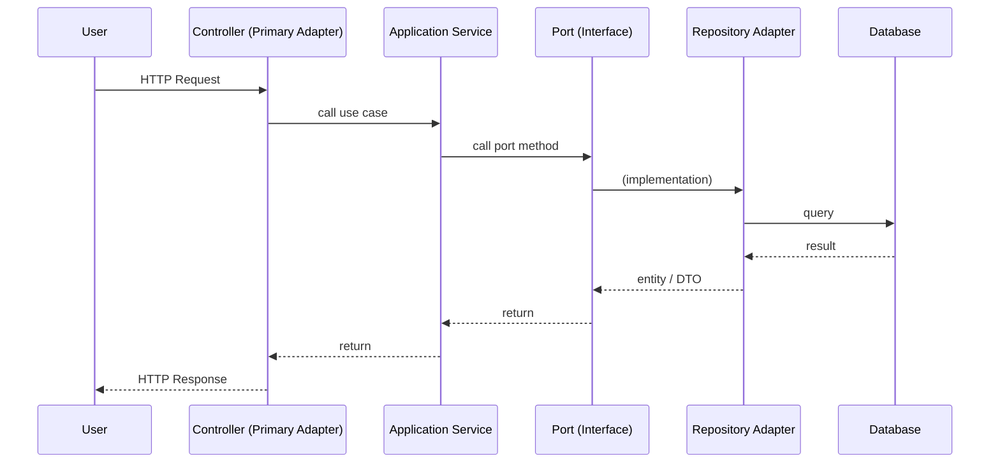
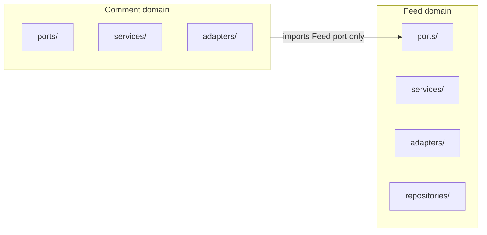

# Designing Hexagonal Architecture

*Portions of this skill (e.g. decision trees, directory structure, anti-patterns) are sourced from or adapted from [robust-skills/clean-ddd-hexagonal](https://github.com/ccheney/robust-skills/blob/main/skills/clean-ddd-hexagonal/SKILL.md). See [NOTICE](NOTICE).*

## Philosophy / Approach

Hexagonal Architecture, also known as **Ports & Adapters**, separates core business logic from external infrastructure by inverting dependencies and isolating the domain from technical concerns. The application has multiple "sides" (adapters) where it interacts with the world; each side is interchangeable.

**Original intent (Cockburn, 2005):** *"Allow an application to equally be driven by users, programs, automated tests, or batch scripts, and to be developed and tested in isolation from its eventual run-time devices and databases."* The same design addresses both the user side (logic leaking into the UI) and the data side (logic tied to a specific database): the asymmetry to exploit is **inside vs outside** the application. Code pertaining to the inside must not leak into the outside; the application communicates over **ports** to external agencies, and for each external device an **adapter** converts between the port's API and the signals needed by that device.

**Benefits:**
- **Technology independence**: Business logic doesn't depend on specific frameworks or databases
- **Testability**: Core domain can be tested without infrastructure (mock ports); FIT/test harnesses can drive the application against a mock DB before any GUI exists
- **Flexibility**: Swap adapters (DB, APIs) without changing business rules
- **Maintainability**: Clear boundaries make reasoning and refactors easier

## When to Use (and When NOT to)

| Use When | Skip When |
|----------|-----------|
| Designing new backend or service architecture | Simple CRUD, single entry point, fixed stack |
| Refactoring inter-module or layer dependencies | Prototype, throwaway code, tight deadline |
| Introducing ports/adapters or clean-architecture boundaries | Unlikely to swap DB, framework, or external APIs |
| Organizing by business domain with well-defined interfaces | Solo/small team, no need for test doubles or swapping infra |
| Multiple entry points (API, CLI, events) or multiple adapters | One adapter per port with no planned variation |

**Start simple.** Add ports and adapters when you need to test without infra, swap implementations, or keep domain independent of frameworks.

## CRITICAL: The Dependency Rule

Dependencies point **inward only**. Outer layers depend on inner layers, never the reverse.

```
Infrastructure → Application → Domain
   (adapters)     (use cases)    (ports, core)
```

**Violations to catch:**
- Domain importing database/HTTP libraries
- Controllers calling repositories directly (bypassing use cases)
- Entities depending on application services
- Ports defined in a shared `core/ports/` instead of the owning domain

**Design validation:** "Create your application to work without either a UI or a database" — Alistair Cockburn. If you can run core logic from tests with no infrastructure, boundaries are correct.

### What crosses boundaries (Clean Architecture)

Data that crosses layer boundaries should be **simple, isolated data structures**—e.g. plain structs, DTOs, or function arguments. Do not pass ORM entities, database rows, or framework-specific types inward; that would make inner circles depend on outer ones. *"When we pass data across a boundary, it is always in the form that is most convenient for the inner circle."* (Robert C. Martin)

**Clean Architecture’s four circles** (Uncle Bob) map well to Hexagonal: **Entities** (domain); **Use Cases** (application); **Interface Adapters** (presenters, controllers, persistence adapters); **Frameworks & Drivers** (DB, web framework). The Dependency Rule is the same: source code dependencies point inward only. Crossing boundaries is done via dependency inversion—e.g. use case calls an interface in the inner circle, adapter in the outer circle implements it.

## Quick Decision Trees

### "Where does this code go?"

```
Where does it go?
├─ Pure business logic, no I/O           → domain/
├─ Orchestrates domain + has side effects → application/
├─ Talks to external systems              → infrastructure/ (adapter)
├─ Defines HOW to interact (interface)    → port (domain or application, in owning domain)
└─ Implements a port                      → adapter (infrastructure)
```

Ports live in the **domain that owns them** (e.g. `feed/ports/`, `billing/ports/`), not in a shared `core/ports/` or `common/ports/`.

### "Is this an Entity or Value Object?" (when using DDD)

```
Entity or Value Object?
├─ Has unique identity that persists → Entity
├─ Defined only by its attributes    → Value Object
├─ "Is this THE same thing?"         → Entity (identity comparison)
└─ "Does this have the same value?"  → Value Object (structural equality)
```

### "Should this be its own Aggregate?" (when using DDD)

```
Aggregate boundaries?
├─ Must be consistent together in a transaction → Same aggregate
├─ Can be eventually consistent                 → Separate aggregates
├─ Referenced by ID only                        → Separate aggregates
└─ >10 entities in aggregate                    → Split it
```

**Rule:** One aggregate per transaction. Cross-aggregate consistency via domain events (eventual consistency).

## Directory Structure

```
src/
├── domain/                    # Core business logic (NO external dependencies)
│   ├── {aggregate}/
│   │   ├── entity              # Aggregate root + child entities
│   │   ├── value_objects       # Immutable value types
│   │   ├── events              # Domain events
│   │   ├── repository          # Repository interface (DRIVEN PORT)
│   │   └── services            # Domain services (stateless logic)
│   └── shared/
│       └── errors              # Domain errors
├── application/               # Use cases / Application services
│   ├── {use-case}/
│   │   ├── command             # Command/Query DTOs
│   │   ├── handler             # Use case implementation
│   │   └── port                # Driver port interface
│   └── shared/
│       └── unit_of_work        # Transaction abstraction
├── infrastructure/            # Adapters (external concerns)
│   ├── persistence/           # Database adapters
│   ├── messaging/             # Message broker adapters
│   ├── http/                  # REST/GraphQL adapters (DRIVER)
│   └── config/
│       └── di                  # Dependency injection / composition root
└── main                        # Bootstrap / entry point
```

## DDD Building Blocks (when combining with DDD)

| Pattern | Purpose | Layer | Key Rule |
|---------|---------|-------|----------|
| **Entity** | Identity + behavior | Domain | Equality by ID |
| **Value Object** | Immutable data | Domain | Equality by value, no setters |
| **Aggregate** | Consistency boundary | Domain | Only root is referenced externally |
| **Domain Event** | Record of change | Domain | Past tense naming (`OrderPlaced`) |
| **Repository** | Persistence abstraction | Domain (port) | Per aggregate, not per table |
| **Domain Service** | Stateless logic | Domain | When logic doesn't fit an entity |
| **Application Service** | Orchestration | Application | Coordinates domain + infra |

## Visual Overview

### Dependency direction (inward)

Outer layers depend on inner layers; the domain does not depend on infrastructure.



### Hexagonal shape: Ports & Adapters

The domain (hexagon) exposes **ports** (interfaces). **Primary (driving) adapters** call into the domain; **secondary (driven) adapters** are called by the domain.



### Request flow (sequence)

A typical read: request enters through a primary adapter, application service uses a port, and a secondary adapter (e.g. repository) talks to the database.



## Core Concepts

Hexagonal Architecture is built on several fundamental principles that work together to create a robust, maintainable system.

### 1. Layer Separation

The application is organized into distinct layers, each with specific responsibilities:

- **Presentation Layer**: HTTP requests/responses, DTO transformation, user interface concerns
- **Application Layer**: Business logic orchestration, transaction management, use case implementation
- **Domain Layer**: Core business rules, domain models, business validations
- **Infrastructure Layer**: Database access, external APIs, file systems, third-party integrations

The dependency direction flows from outer layers toward the domain at the center.

### 2. Port - Interface Abstraction

Ports define the boundaries between the domain and the outside world. They are interfaces that express what the business logic needs or exposes, without specifying how it's implemented.

**Characteristics of Ports:**
- Defined as interfaces or abstract contracts
- **Live in the domain that owns them** (e.g. `feed/ports/IFeedService.port.ts`), not in a shared `common/ports/` folder—each domain module owns its port interfaces
- Express business needs in domain language
- Independent of implementation details

### 3. Adapter - Concrete Implementation

Adapters are concrete implementations of Port interfaces. They handle the actual communication with external systems and infrastructure.

**Types of Adapters:**
- **Primary/Driving Adapters**: Controllers, REST endpoints, GraphQL resolvers (drive the application)
- **Secondary/Driven Adapters**: Repositories, external service clients, messaging systems (driven by the application)

Adapters translate between the domain's language and the technical protocols of external systems.

**Repository (Fowler, PoEAA):** A repository mediates between the domain and data mapping, exposing a **collection-like interface** for domain objects—add, remove, and query by specification. It encapsulates the set of objects persisted and the operations over them, giving an object-oriented view of persistence and keeping the domain independent of storage details.

**Unit of Work (Fowler, PoEAA):** Keeps track of every object affected by a business transaction and coordinates writing changes (and concurrency). Use it so the application layer can commit a logical transaction without the domain knowing about the DB.

### 4. Dependency Inversion

One of the most critical principles: dependencies point inward, toward the domain.

**Dependency Flow:**
```
External → Infrastructure → Application → Domain
```

**Key Rules:**
- Inner layers (domain) must never depend on outer layers
- Business logic remains independent of infrastructure
- Interfaces are defined by the domain, implemented by infrastructure

### 5. Applying SOLID Principles

Hexagonal Architecture naturally aligns with SOLID principles:

- **Single Responsibility**: Each module handles one specific concern
- **Open/Closed**: System is open for extension (new adapters) but closed for modification (domain remains stable)
- **Liskov Substitution**: Adapters implementing the same port are interchangeable
- **Interface Segregation**: Ports expose only the methods needed by the domain
- **Dependency Inversion**: Domain depends on abstractions (ports), not concrete implementations (adapters)

### 6. Module Independence

Each domain module operates independently with minimal coupling: clear boundaries, communication only through ports, and no circular dependencies by design (one domain may depend on another's port; avoid mutual dependency).

### 7. Where Ports Live (per domain)

Keep port interfaces in the **owning domain folder**, so dependency direction stays clear:



Example: `feed/ports/IFeedService.port.ts` is owned by Feed; Comment imports it via `../feed/ports/IFeedService.port` and injects the implementation at runtime.

**Anti-pattern:** Do not put all ports in a single shared folder (e.g. `core/ports/`, `common/ports/`, or `src/ports/`). That breaks domain ownership and makes dependency direction unclear. Use `<domain>/ports/` (e.g. `billing/ports/`, `feed/ports/`) so each domain owns its contracts.

### CQRS and when to consider it (Fowler)

**CQRS** = Command Query Responsibility Segregation: use a different model for updates (commands) than for reads (queries). Apply only where it pays off: (1) a few complex domains where command and query needs really differ, or (2) high-performance systems where you need to scale or optimize reads and writes separately. Use CQRS **per Bounded Context**, not for the whole system. For most systems it adds risky complexity—prefer a single model until you have a clear need.

### Event Sourcing (Fowler)

**Event Sourcing** = store all changes to application state as a **sequence of events**. You get: event replay (fix or reorder events and recompute), temporal queries (state at any point in time), and full rebuild from the event log. Often the event log is the system of record and current state is a derived cache. Fits well with CQRS and domain events; use when audit trail and time-travel matter more than simple CRUD.

### Reliable messaging: Transactional Outbox (microservices.io)

When a use case must **both** update the database **and** send a message (e.g. domain event to a broker), you need atomicity without distributed transactions (2PC). **Transactional Outbox:** in the same DB transaction, (1) update domain state and (2) insert the outgoing message into an outbox table. A separate **relay** process reads the outbox and publishes to the message broker. Messages are sent if and only if the transaction commits; consumers should be idempotent (at-least-once delivery).

### Domain events (Udi Dahan)

**Domain events** record something that already happened in the domain (past tense: `OrderPlaced`, `CustomerBecamePreferred`). Model them as an explicit role (e.g. `IDomainEvent`). Entities raise events when significant state changes occur—**without** injecting repositories or application services into the entity; use a static or request-scoped dispatcher so the entity stays pure. Domain events help keep the domain model encapsulated and are a bottom-up way to discover bounded contexts (many small, cohesive events often align with one context).

### Bounded Context (DDD strategic design, Fowler)

When the domain is large, a single unified model becomes inconsistent (e.g. "customer" or "product" means different things in different parts of the business). **Bounded Context** is an explicit boundary within which the model is consistent and the **ubiquitous language** applies. Split the system into bounded contexts and be explicit about how they relate (context map). Hexagonal/ports-and-adapters can be applied inside each context; use anti-corruption layers or events at context boundaries.

## Output Checklist

When giving structure, refactor plans, or code guidance, ensure your answer includes:

- **Layered structure** — Domain/ports, application (use cases), and adapters (HTTP, DB, external APIs) with dependency direction inward.
- **Ports in owning domain** — Port interfaces live in the domain folder that owns them (e.g. `billing/ports/`, not `core/ports/`).
- **Thin primary adapters** — Controllers/handlers only handle HTTP (parse, call use case, serialize); no business logic.
- **Framework wiring** — If the user's stack is NestJS, show module-based layout and port export; if Hono, show middleware and `c.set` so handlers receive the port; if Elysia, show plugin and `.decorate()`/`.derive()`.

## Implementation Workflow

### Step 1: Identify Domain Boundaries

Begin by understanding your business domains and their relationships. Map out:
- Core business entities and their responsibilities
- Natural boundaries between different business concerns
- Use cases and workflows within each domain

### Step 2: Define Ports

For each domain module, identify what it needs from the outside world and what it provides to others. Define port interfaces **inside that domain** (e.g. `feed/ports/`, `billing/ports/`), not in a shared layer like `core/ports/` or `common/ports/`.
- **Inbound Ports**: Use cases the domain exposes (e.g. `IFeedServicePort`) for other modules to call
- **Outbound Ports**: Dependencies the domain requires (e.g. `IFeedRepository`) implemented by infrastructure

### Step 3: Implement Domain Logic

Build the core business logic without any infrastructure concerns:
- Create domain models and entities
- Implement business rules and validations
- Write services that orchestrate use cases
- Keep domain logic pure and testable

### Step 4: Create Adapters

Implement concrete adapters for each port:
- Primary adapters to expose domain functionality (controllers, event handlers)
- Secondary adapters to fulfill domain dependencies (database repositories, API clients)

### Step 5: Configure Dependency Injection

Wire everything together using a DI container:
- Bind port interfaces to adapter implementations
- Configure module relationships
- Resolve circular dependencies if needed

### Incremental Refactor (existing codebase)

When refactoring toward ports and adapters without a rewrite: (1) Pick one vertical slice or use case. (2) Define a port interface in the **owning domain** (e.g. `order/ports/IOrderRepository.port.ts`). (3) Move business logic from the controller into an application/use-case service that depends on the port. (4) Make the existing repository implement the port (adapter). (5) Thin the controller to parse → call service → serialize. (6) Wire port to adapter in the composition root (DI/module/middleware). Repeat for other slices. Do not introduce a shared `core/ports/`—keep each port in its domain folder.

### Implementation Order (summary)

1. **Discover the Domain** — Event Storming, conversations with domain experts
2. **Model the Domain** — Entities, value objects, aggregates (no infra)
3. **Define Ports** — Repository interfaces, external service interfaces
4. **Implement Use Cases** — Application services coordinating domain
5. **Add Adapters last** — HTTP, database, messaging implementations

**DDD is collaborative.** Modeling sessions with domain experts are as important as the code patterns.

## Patterns / Examples

Framework-specific, standalone examples (ports in each domain, full wiring) are in `./examples/`. **Read only the example that matches your stack**—each file is self-contained and long; do not load all three.

| Example | Stack | Highlights |
|--------|--------|------------|
| [nest-ts.md](./examples/nest-ts.md) | NestJS | DI, `@Inject('IPort')`, modules export ports |
| [elysia-ts.md](./examples/elysia-ts.md) | ElysiaJS | Plugins, `.decorate()`/`.derive()`, TypeBox |
| [hono-ts.md](./examples/hono-ts.md) | Hono | Middleware, `c.set`/`c.get` Variables, Zod |

Each example demonstrates: (1) Port interface in the owning domain, (2) Adapter implementing the port, (3) Wiring (module/plugin/middleware), (4) Repository (infrastructure), (5) Layered flow (controller → service → port → adapter), (6) Consuming another domain via its port only.

When answering: mirror the example for the user's stack—e.g. NestJS use `modules/<domain>/ports/` and module exports; Hono use middleware that does `c.set('portName', adapter)` so handlers get the port via `c.get('portName')`; Elysia use a plugin that `.decorate()`s the port.

Each example file is long (400+ lines). Sections to look for: port interface definition, adapter implementation, module/plugin/middleware wiring, repository, controller/routes, cross-domain consumption. Use the example’s structure and naming rather than inventing a different layout.

## Best Practices

### Clear Layer Separation

Maintain strict separation between layers with consistent dependency direction. Each layer should have a single, well-defined responsibility. Never allow business logic to leak into presentation or infrastructure layers.

**Guidelines:**
- Controllers should only handle HTTP concerns (validation, serialization)
- Services contain business logic and orchestration
- Repositories handle data persistence
- Keep domain models independent of ORM annotations

### Minimize Port Interfaces

Design ports to expose only the methods needed by the domain. Follow the Interface Segregation Principle by creating focused, role-specific interfaces rather than large, monolithic ones.

**Guidelines:**
- Create separate ports for different client needs
- Avoid "god interfaces" with many unrelated methods
- Name ports based on their business purpose
- Keep port methods at the right level of abstraction

### Domain-Based Module Separation

Organize code by business domain rather than technical layers. Each domain module owns its ports and is loosely coupled to other domains.

**Guidelines:**
- **Place port interfaces in the domain that owns them** (e.g. `feed/ports/`), so other domains import from `../feed/ports/` rather than a shared `common/ports/feed/`
- Communicate between modules only through ports; consuming modules depend on the port interface, not the implementing adapter or service
- Use forwardRef (or framework equivalents) only when circular dependencies are unavoidable; prefer one-way dependency (e.g. Comment → Feed)
- Keep each module independently testable

## Anti-Patterns (CRITICAL)

| Anti-Pattern | Problem | Fix |
|--------------|---------|-----|
| **Shared ports folder** | All ports in `core/ports/` or `common/ports/` | Put each port in the owning domain (e.g. `feed/ports/`, `billing/ports/`) |
| **Skipping ports** | Controllers → Repositories directly | Always go through application layer; controller calls use case, use case uses port |
| **Leaking infrastructure** | Domain or app importing DB/HTTP libs | Domain and ports have zero external deps; adapters implement ports |
| **Thick primary adapters** | Business logic in controllers | Controllers: parse → call use case → serialize only |
| **God port** | One interface with many unrelated methods | Interface segregation; focused ports per role |
| **Reverse dependency** | Domain depends on adapter or framework | Domain defines port; infrastructure implements it |
| **Anemic Domain Model** | Entities are data bags, logic in services | Move behavior INTO entities |
| **Repository per Entity** | Breaks aggregate boundaries | One repository per AGGREGATE |
| **God Aggregate** | Too many entities, slow transactions | Split into smaller aggregates |
| **CRUD Thinking** | Modeling data, not behavior | Model business operations |
| **Premature CQRS** | Adding complexity before needed | Start with simple read/write, evolve |
| **Cross-Aggregate TX** | Multiple aggregates in one transaction | Use domain events for consistency |

## Common Pitfalls

### Managing Circular Dependencies

Circular dependencies between modules indicate design issues. While forwardRef provides a technical solution, it's important to analyze the root cause.

**Warning Signs:**
- Multiple modules depending on each other
- Deep dependency chains that loop back
- Difficulty in testing modules in isolation

**Solutions:**
- Introduce a shared kernel for common concepts
- Use events for decoupled communication
- Extract a new module if responsibilities are mixed
- Apply dependency inversion through ports

### Consider Testability

Architecture should facilitate testing, not hinder it. Ports enable easy mocking, but only if designed properly.

**Common Issues:**
- Ports that expose implementation details
- Tight coupling between layers despite using interfaces
- Difficulty in creating test doubles

**Solutions:**
- Design ports from the domain's perspective
- Use constructor injection for all dependencies
- Create in-memory adapters for testing
- Write tests that don't require infrastructure

### Avoid Over-Abstraction

Not every interaction needs a port-adapter pair. Over-engineering leads to unnecessary complexity.

**When to Avoid:**
- Simple CRUD operations with no business logic
- One-to-one mapping between port and adapter with no variation
- Internal utilities that won't change

**Balance:**
- Start simple, add abstraction when needed
- Apply ports where flexibility matters
- Consider the likelihood of implementation changes

### Performance Impact Analysis

Layer separation and indirection can introduce overhead. Monitor and optimize where necessary.

**Considerations:**
- Extra method calls through ports/adapters
- Object mapping between layers
- Transaction boundaries across layers

**Optimization Strategies:**
- Use profiling to identify actual bottlenecks
- Apply caching at appropriate layers
- Consider batch operations for high-volume scenarios
- Don't optimize prematurely - measure first

## Reference Documentation

The `references/` folder in this skill is sourced from [robust-skills/skills/clean-ddd-hexagonal/references](https://github.com/ccheney/robust-skills/tree/main/skills/clean-ddd-hexagonal/references) (Clean Architecture + DDD + Hexagonal). Each file expands on the concepts in this SKILL:

| File | Purpose |
|------|---------|
| [references/LAYERS.md](references/LAYERS.md) | Four layers (Domain, Application, Infrastructure, Presentation); dependency rules; domain/application/infra structure with examples |
| [references/HEXAGONAL.md](references/HEXAGONAL.md) | Cockburn quote, driver/driven ports, adapter examples, API-shaped application core, sample code layout |
| [references/DDD-STRATEGIC.md](references/DDD-STRATEGIC.md) | Bounded contexts, context mapping (when combining with DDD) |
| [references/DDD-TACTICAL.md](references/DDD-TACTICAL.md) | Entities, value objects, aggregates, repository per aggregate (when combining with DDD) |
| [references/CQRS-EVENTS.md](references/CQRS-EVENTS.md) | Command/query separation, domain events |
| [references/TESTING.md](references/TESTING.md) | Unit, integration, architecture tests |
| [references/CHEATSHEET.md](references/CHEATSHEET.md) | Layer summary diagram, "where does this code go?", entity/value object, aggregate decision trees |

## Sources

All links below were fetched and verified. Descriptions summarize the linked content.

### Primary Sources
- [The Clean Architecture](https://blog.cleancoder.com/uncle-bob/2012/08/13/the-clean-architecture.html) — Robert C. Martin (2012). Concentric circles (Entities, Use Cases, Interface Adapters, Frameworks); the Dependency Rule (dependencies point inward); crossing boundaries via Dependency Inversion; data crossing boundaries as simple structs/DTOs. Systems independent of UI, DB, and frameworks.
- [Hexagonal Architecture](https://alistair.cockburn.us/hexagonal-architecture/) — Alistair Cockburn (2005). Original Ports & Adapters article. Intent: allow the application to be driven by users, tests, or batch scripts and developed/tested in isolation from run-time devices and databases. Ports as APIs; adapters for each external device; symmetry between user-side and data-side; sample FIT + app + mock DB staging.
- [Domain-Driven Design: The Blue Book](https://www.domainlanguage.com/ddd/blue-book/) — Eric Evans (2003/2004). The "blue book" that established DDD: framework for design decisions and vocabulary for domain design; for projects facing complex domains.
- [Implementing Domain-Driven Design](https://openlibrary.org/works/OL17392277W) — Vaughn Vernon (2013). Book (catalog link). Tactical and strategic DDD implementation; aggregates, repositories, domain events, bounded contexts.

### Pattern References
- [CQRS](https://martinfowler.com/bliki/CQRS.html) — Martin Fowler. Command Query Responsibility Segregation: different models for updates vs reads; when to use (complex domains, high performance); caution—adds complexity; use per Bounded Context, not whole system.
- [Event Sourcing](https://martinfowler.com/eaaDev/EventSourcing.html) — Martin Fowler. Capture all state changes as a sequence of events; event replay, temporal query, complete rebuild; application state vs event log; reversing events.
- [Repository Pattern](https://martinfowler.com/eaaCatalog/repository.html) — Martin Fowler (PoEAA). Mediates between domain and data mapping; collection-like interface for domain objects; keeps domain independent of persistence.
- [Unit of Work](https://martinfowler.com/eaaCatalog/unitOfWork.html) — Martin Fowler (PoEAA). Tracks objects affected by a business transaction; coordinates writing changes and concurrency; part of PoEAA.
- [Bounded Context](https://martinfowler.com/bliki/BoundedContext.html) — Martin Fowler. DDD strategic design: divide large models into bounded contexts with explicit relationships; ubiquitous language; context maps.
- [Transactional Outbox](https://microservices.io/patterns/data/transactional-outbox.html) — microservices.io (Chris Richardson). Atomically update DB and send messages: store message in DB in same transaction; separate relay sends to broker; avoids 2PC; ordering and at-least-once delivery.
- [Effective Aggregate Design](https://www.dddcommunity.org/library/vernon_2011/) — Vaughn Vernon. Three-part series on aggregate modeling: consistency boundaries, size, relationships; rules of thumb; discovery process; links to PDFs and talks.

### Implementation Guides
- [Microsoft: DDD + CQRS Microservices](https://learn.microsoft.com/en-us/dotnet/architecture/microservices/microservice-ddd-cqrs-patterns/) — .NET microservices guide. Tackle business complexity with DDD and CQRS inside a microservice; domain model per bounded context; references to Evans, Vernon, Greg Young, Udi Dahan; eShopOnContainers.
- [Domain Events – Salvation](https://udidahan.com/2009/06/14/domain-events-salvation/) — Udi Dahan. Domain events as explicit role (e.g. `IDomainEvent`); raise from entities without injecting services; static `DomainEvents.Raise`; unit testing; bottom-up way to find bounded contexts.
- Framework-specific examples in this skill: [NestJS](examples/nest-ts.md), [Elysia](examples/elysia-ts.md), [Hono](examples/hono-ts.md) — ports in owning domain, adapter wiring, repository, controller → service → port → adapter.

---

**License & attribution:** This skill is part of the repository (see root LICENSE). Third-party and external materials are attributed in [NOTICE](NOTICE). Some SKILL.md content (e.g. decision trees, directory structure, anti-patterns, implementation order) is sourced from or adapted from [robust-skills/clean-ddd-hexagonal/SKILL.md](https://github.com/ccheney/robust-skills/blob/main/skills/clean-ddd-hexagonal/SKILL.md). Reference docs in `references/` are from [robust-skills/references](https://github.com/ccheney/robust-skills/tree/main/skills/clean-ddd-hexagonal/references). External articles above are linked and cited, not included verbatim.
